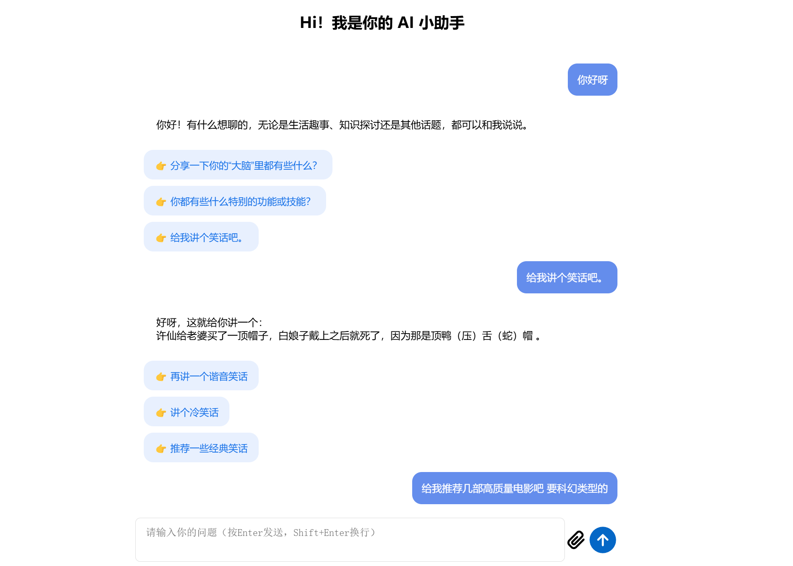

**项目介绍**
**LLM-Dialog-Component**是一个基于 React 框架开发的聊天应用，集成了 Coze API，用户能与聊天机器人交互，支持文本、文件和图片输入，并展示聊天历史记录。

- 前端技术：
  使用 React 18.2.0 构建用户界面，利用 React Router DOM 进行路由管理，通过 React Markdown 处理 Markdown 格式文本，借助 React Copy to Clipboard 实现内容复制功能。样式方面采用 CSS 进行页面布局和样式设计。
- 后端技术：  
  1.使用 Node.js + Express，轻量且高效，适合处理 API 请求和响应。 2.使用 Coze API 的后端服务处理聊天请求。
- API 依赖：  
  1.接入 CozeAI API，作为核心功能实现的基础。  
  2.使用 Axios 库进行 HTTP 请求，简化 API 调用逻辑。
- 部署与运维：  
  可通过 react - scripts build 构建生产版本，部署到服务器上。可使用如 Netlify、Vercel 等平台进行部署，也可自行搭建服务器环境。利用.env 文件存储 API 密钥和 Bot ID，避免在代码中硬编码，提高安全性。
